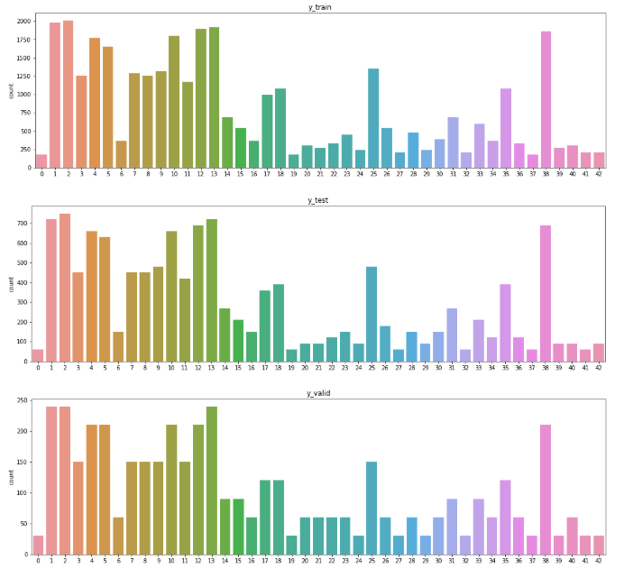

# Traffic Sign Classification

# DataSet Exploration 

Dataset exploration id performed in cell number 1 to 8

In cell number 1 data is imported from the location in the PC, there were 
three pickle files containing datafiles, for train, test and validation.
THe images and the labels for train, test and validation is separated.

In Cell number two we are checking the shape of data to understand the 
volume of data and the proportion of train, test and validation set.

  <table>
<tr><td>Train Set</td><td>(34799, 32, 32, 3)</td></tr>
<tr><td>Test Set</td><td>(12630, 32, 32, 3)</td></tr>
<tr><td>Validation Set</td><td>(4410, 32, 32, 3)</td></tr>
</table>
 

There are total 43 class images of traffic signs.

In cell number 6, 5 randomly selected images from each class are visalized.
Analysis shows that, some of the images are completely balck and are not 
very sharp, images in many classses are blurred.
A snippet of that is shown below - 

In cell number 8 A countplot of images in all classes in train, test and 
validation data is plotted.
The plot shows that the proportion of images in all the three sets in
respective classes is same BUT the count of images in all the classes is 
not uniform, In class 1,2,4,5,10,12,13,25,38 is much higher where as in 
classes 0,6,19,20,21,22,23,24,27,29,32,34,35,36,37,39,40,41,42,43  are 
very low.

Analysis - Image augementation in specific classes in train data can help 
in making the count of images in all the classes uniform.

# Design and Test Model Architecture

The Designing and testing of model is implemented in cell number 9  to cell number 12

## Preprocessing

1. Scaling

All the images are scalled by dividing the pixel values by 255 so that pixel values can range from 0 to 1
  

2. Image Augementation

In order to make sure that the number of images in each label is similar,
image augementation needs to be done.

In cell number 9 three functions are created,

In function increase_brightness() with every image we are adding a value between 0 to 0.5 choosen randomly.
This should increase brightness of the image

In function random_rotate(), the images are rotated to random angle between -20 to 20 using
openCV.
Using cv2.getRotationMatrix2D(), the rotation matrix M is obtained, and using 
cv2.warpAffine() function rotated image is obtained.

In function random_zoom() image zooming is done. First the image is resized to a random
size of originial image with zoomsize between 1.2 to 2.0.
then from center of the image image of size 32x32 is cropped to obtain the 
zoomed image of original size.

Zoom, brightness and slight random rotate should not change the original meaning of sign.
Initially I though of usig flip, but that would change the meaning of some
of the traffic signs.
A higher rotation angle will also impact the sign meaning, so a lower angle is used.

  

In cell number 10 the Image augementation is applied.
On labels having less than 750 iamges, the augementaion method is applied.
for labels having less than 250 images, 750 new augemented images will be added.
for labels having less than 500 and greated than 250 images, 500 new augemented images will be added.
for labels having less than 750 and greated than 500 images, 250 new augemented images will be added.

After performing augementation, the labels have good volume and uniform number of images.

After performing above step now the training set has shape (48799, 32, 32, 3) 

## Model Architecture

The lenet architecure is modified to achieve the requried result.
Follwoing is the architecture used in the current model to achieve results

## Training the model

The model is trained for 50 epochs
In cell number 15 x and y as feature set and label set placeholders are created.
the target is onehot encoded as per the model architecture.
In cell number 16 
the cost function for softmax function is creted and then the adam optmizier with learning rate 0.00 is used.

In Cell number 17 the function for evaluation of model is created.

In cell number 18 we are training the model.
images in batch size of 128 are loaded and the model is trianed till 50 epochs.
In every epoch we are printing the accuracy of model on validation data.
In 50th epoch finally we could get 0.96 accuracy on validation data and 0.999 accuracy on trianing data

In cell number 19 we are calculating the accurayc of model on test data and it is 0.94

# Testing the model on new images

10 new images from google search are collected to for testing
<table>
<tr><td></td><td>
</td><td></td><td>
</td><td></td></tr>
<tr><td></td><td>
</td><td></td>
<td>
</td><td>
    </td></tr><table>

In cell number 24 the labels are assigned based on observation from images.
 new_labels = [33,14,34,27,3,13,9,1,4,25]

In cell number 25 we are checking the performance of model on these new images which is
0.80 obtained here.
